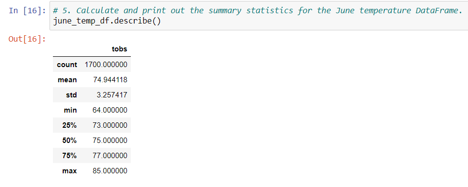
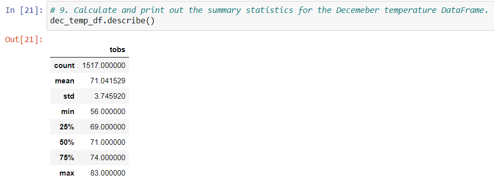

# surfs_up

## Project Overview

The purpose of this project is to determine the sustainability of a surf/ice cream shop year round in Oahu based on weather data. Normally, people are more likely to have ice cream when the weather is warm and if we know for certain that all parts of the year maintain a reasonably warm enough temperature, we then know if we can keep slingin' scoops of ice cream through all months of the year. 

## Results/Summary

We analyzed weather data for the months of December and June from 2010 to 2016. Here's the summary data about temperature data over both months during this time interval:

#### June Weather Data

#### December Weather Data

Looking at this data it seems the average temperature does not vary much between the months. June recorded a mean temp of 74.9 degress while in December, the mean temp was 71.0 degrees. The standard deviation between the two months stands at 3.25 versus 3.75 for June and December respectively, indicating there isn't that much variation that exists between temperature. Observing this, it seems inconclusive that we will have warm weather throughout the year, making ice cream a desirable option for tourists during the entire year! 

Now, limitations about this study - we only looked at a couple months within the year. This may be a bit more comprehensive if we were to introduce more months into this analysis and maybe find if there are other months where temperature can be significantly different than from what we anticipate with the typical June/December opposites. All in all however, looking at data between these months we seem to have a winner in opening up an ice cream surf shop in Oahu. Surfs up and cones out all year round! 
